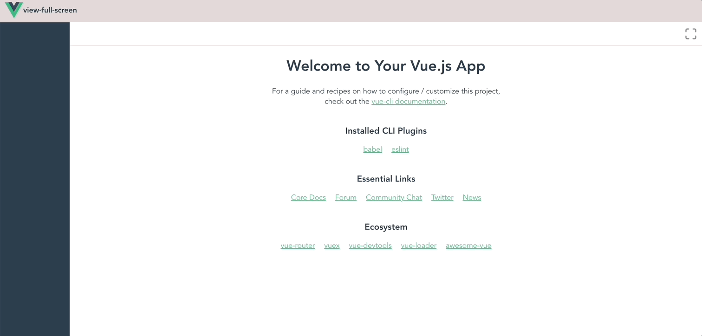

# view-full-screen

一个用于将任意组件放大到铺满全屏，不受父控件样式约束的vue组件

[演示地址](https://codbking.github.io/view-full-screen)



## Install
```
npm i view-full-screen
```
## Quick Start
```js
// main.js
import Vue from 'vue'
import viewFullScreen from "view-full-screen"

Vue.use(viewFullScreen)
```
```vue
<!-- your components-->
<view-full-screen :is-full-screen="isFullScreen"  class="right">
    <!--your code-->

</view-full-screen>

data() {
    return {
        isFullScreen: false 
    }
}
```


